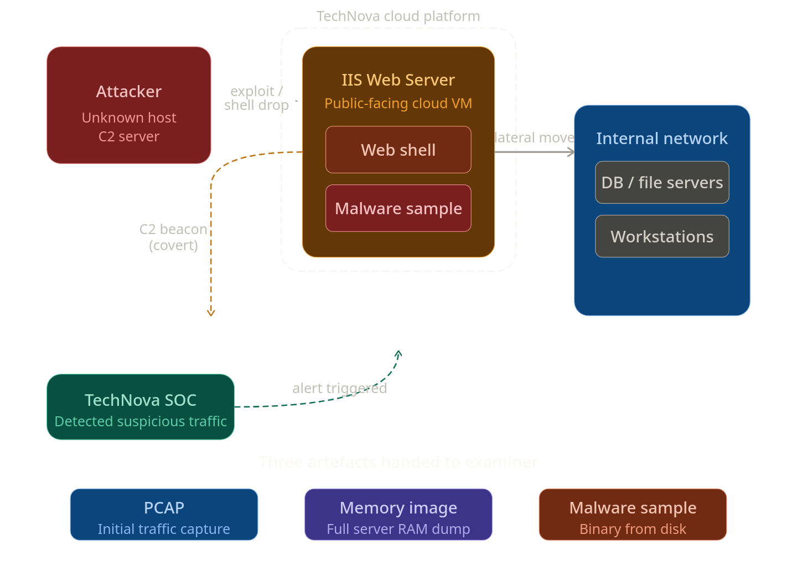

# **Lockdown Lab**
  # **Scenario**
- TechNova Systems’ SOC has detected suspicious outbound traffic from a public-facing IIS server in its cloud platform—activity suggestive of a web-shell drop and covert connections to an unknown host.
- As the forensic examiner, you have three critical artefacts in hand: a PCAP capturing the initial traffic, a full memory image of the server, and a malware sample recovered from disk. Reconstruct the intrusion and all of the attacker’s activities so TechNova can contain the breach and strengthen its defenses.
